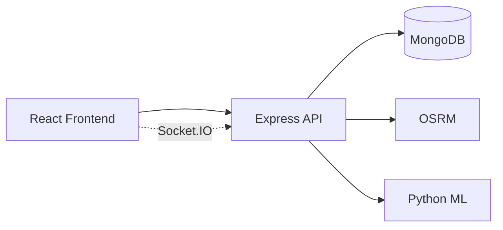

# Rapid Route

Intelligent multi-modal logistics and route management platform for transportation and delivery operations.

Rapid Route helps an operations team manage shipments, vehicles, and drivers; calculate OSRM road routes; estimate logistics ETA with ML; and monitor deliveries on an interactive map — including a clearly labeled **demo simulation** for live tracking.

> Interview-ready note: tracking is simulated (not hardware GPS), the ML dataset is synthetic, and weather is optional. The system is designed to be technically credible and explainable.

## Screenshots

Add screenshots here after running locally:

- Landing page
- Admin dashboard
- Shipment detail map
- Public tracking page

## Features

- JWT auth with Admin / Dispatcher / Driver roles
- Professional landing page and operations console
- Shipment, vehicle, and driver management (CRUD, search, filters, pagination)
- Interactive Leaflet map with OSRM polylines
- Explainable route optimization layer (OSRM + capacity/urgency scoring)
- XGBoost ML service for transport mode + logistics ETA
- Demo vehicle tracking over Socket.IO
- Public tracking page by tracking number
- Notifications, optional weather, dashboard analytics
- Docker Compose + GitHub Actions CI

## Architecture



Details: [docs/architecture.md](docs/architecture.md)

## Tech stack

| Layer | Stack |
|-------|-------|
| Frontend | React, Vite, Tailwind, React Router, Leaflet, Recharts, Socket.IO |
| Backend | Node.js, Express, Mongoose, JWT, bcrypt, Helmet, rate limit |
| ML | Python, pandas, scikit-learn, XGBoost, Flask |
| Routing | OSRM + OpenStreetMap |
| Data | MongoDB |
| DevOps | Docker Compose, GitHub Actions |

## Folder structure

```text
rapid-route/
  frontend/          React SPA
  backend/           Express API + seed + tests
  ml/                Dataset, training, prediction API
  database/          Legacy PostgreSQL notes (v0 scaffold)
  docker/            Optional OSRM data directory
  docs/              Architecture, API, ML, OSRM, setup
  docker-compose.yml
```

## Quick start (local)

### Prerequisites

Node 20+, Python 3.12+, MongoDB (or Docker).

### 1. Environment

```bash
cp backend/.env.example backend/.env
cp frontend/.env.example frontend/.env
```

### 2. MongoDB

```bash
docker run -d --name rapid-mongo -p 27017:27017 mongo:7
```

### 3. ML service

```bash
cd ml
python -m venv .venv
# Windows: .venv\Scripts\activate
pip install -r requirements.txt
python src/train.py
# Windows PowerShell:
$env:PYTHONPATH="src"; python src/app.py
```

### 4. Backend

```bash
cd backend
npm install
npm run seed
npm run dev
```

### 5. Frontend

```bash
cd frontend
npm install
npm run dev
```

Open http://localhost:5173

## Demo credentials

Created by `npm run seed` in `backend`:

| Role | Email | Password |
|------|-------|----------|
| Admin | admin@rapidroute.in | Admin@123 |
| Dispatcher | dispatcher@rapidroute.in | Admin@123 |
| Driver | ravi.driver@rapidroute.in | Admin@123 |

Do not commit real secrets. Change `JWT_SECRET` before any shared deployment.

## Environment variables

See `backend/.env.example` and `frontend/.env.example`.

Key backend vars:

- `MONGODB_URI`
- `JWT_SECRET`
- `OSRM_BASE_URL` (default public demo OSRM)
- `ML_SERVICE_URL`
- `OPENWEATHER_API_KEY` (optional)
- `TRACKING_SIMULATION_ENABLED`

## OSRM

Routing is proxied by the backend:

`GET /api/routes?origin=lng,lat&destination=lng,lat`

Configure `OSRM_BASE_URL`. For self-hosted OSRM and large map extracts, see [docs/osrm.md](docs/osrm.md). Huge map files are **not** downloaded during builds.

## ML

Synthetic dataset + XGBoost models. Documented in [docs/ml.md](docs/ml.md).

Node calls `POST {ML_SERVICE_URL}/predict`. If ML is down, an explicit heuristic fallback is used and labeled.

## Docker

```bash
docker compose up --build
```

Services: `frontend`, `backend`, `ml`, `mongodb` (optional OSRM commented out).

## API docs

See [docs/api.md](docs/api.md).

## Testing

```bash
cd backend && npm test
cd frontend && npm test && npm run build
cd ml && pip install -r requirements.txt && python src/train.py && PYTHONPATH=src pytest -q
```

## Deployment

This repository ships CI (lint/test/build) but no fake deploy steps. Deploy the four services behind HTTPS with strong `JWT_SECRET`, private MongoDB, and your own OSRM endpoint when ready.

## Limitations

- Live tracking is a **server-side simulator** along OSRM geometries
- ML training data is **synthetic**
- Public OSRM may rate-limit
- Weather requires `OPENWEATHER_API_KEY`
- Optimization is an explainable scoring layer, not a full VRP solver

## Future improvements

- Real GPS / telematics adapters
- Multi-stop VRP solver
- Carrier invoice / cost models
- Role-scoped notification preferences
- Production observability (OpenTelemetry)

## License

MIT
