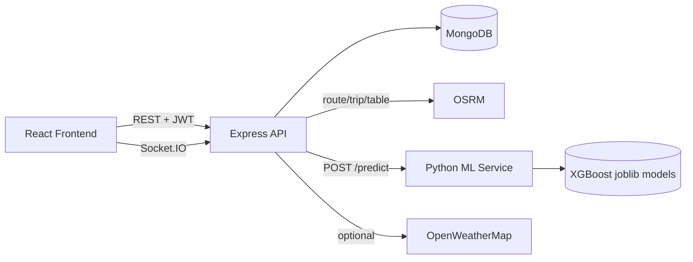

# Architecture

Rapid Route is a multi-service logistics platform.

## Components

### Frontend (`/frontend`)
React SPA with Tailwind, React Router, Leaflet maps, Recharts, and Socket.IO client.

### Backend (`/backend`)
Express REST API with JWT auth, Mongoose models, OSRM proxy, ML client, weather client, and a demo tracking simulator.

### ML (`/ml`)
Flask service exposing `POST /predict` for transport mode classification and ETA regression (XGBoost).

### MongoDB
Stores users, shipments, vehicles, drivers, routes, notifications, and tracking events.

### OSRM
Provides road geometry, distance, and duration. Configurable via `OSRM_BASE_URL`.

## Request flow examples

1. **Create shipment** → backend stores shipment → requests OSRM route → calls ML for mode/ETA → returns enriched shipment.
2. **Map select** → frontend calls `GET /api/routes?origin=lng,lat&destination=lng,lat` → backend calls OSRM → returns GeoJSON polyline.
3. **Start transit** → enables simulation → Socket.IO emits `tracking:update` as the vehicle advances along the route polyline.

## Security boundaries

- Passwords hashed with bcrypt
- JWT required for protected APIs
- Role checks for admin/dispatcher/driver
- Secrets only via environment variables
